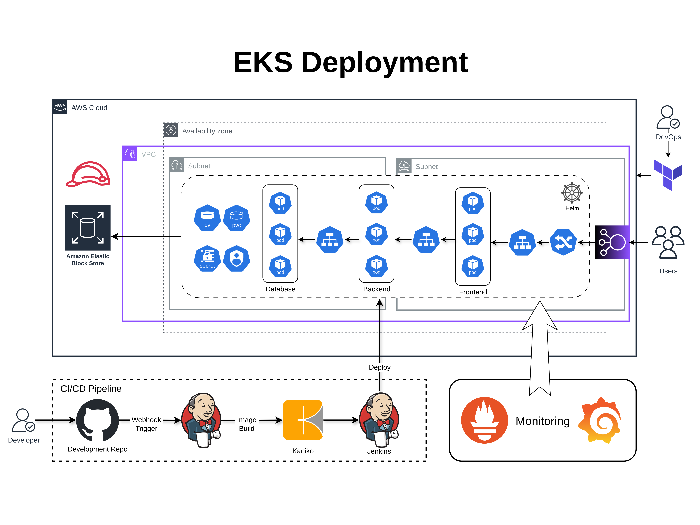

# Devops To-Do List Application with Kubernetes Deployment
##  Architecture Diagram



A production-grade, Devops To-Do List application with automated Kubernetes deployment using Jenkins CI/CD pipeline.

## Project Overview

This project consists of a 3-tier To-Do List application with the following components:

- Frontend: Static web application built with HTML, CSS, and JavaScript
- Backend: Django REST API application
- Database: MySQL database
- Infrastructure: Kubernetes deployment with CI/CD automation

## Architecture

The application is structured into three main components:

1. **Frontend**: Nginx-served static web application
2. **Backend**: Django REST API with health checks and authentication
3. **Database**: MySQL instance for data persistence

## Tech Stack

- **Frontend**: HTML5, CSS3, JavaScript
-   ├── frontend/          # Frontend static web application
│   │   ├── Dockerfile
│   │   ├── index.html
│   │   ├── style.css
│   │   └── script.js
│   └── backend/          # Django backend application
│       ├── Dockerfile
│       ├── apps/
│       └── todo_backend/
├── Manifests/           # Kubernetes manifests
│   ├── deployments.yaml
│   ├── services.yaml
│   └── volumes.yaml
├── Scripts/            # Utility scripts
│   ├── system-up.sh
│   └── docker-commands.sh
├── Helm/              # Helm charts configuration
│   ├── csi-driver.yaml
│   ├── ingress.yaml
│   ├── jenkins.yaml
│   └── monitoring.yaml
├── Terraform/         # Infrastructure as Code
├── Jenkinsfile       # CI/CD pipeline definition
└── README.md
```

## Setup & Deployment

### Prerequisites

- Kubernetes cluster
- Jenkins with Kubernetes plugin
- Docker Hub account
- Helm 3
- kubectl CLI
- Terraform

### Initial Setup

1. Create necessary namespaces:

   ```bash
   kubectl apply -f Manifests/namespaces.yaml
   ```

2. Set up storage and dependencies:

   ```bash
   helm install aws-ebs-csi-driver aws-ebs-csi-driver/aws-ebs-csi-driver
   ```

3. Deploy ingress controller:

   ```bash
   helm install ingress ingress-nginx/ingress-nginx
   ```

4. Set up monitoring:

   ```bash
   helm install monitoring prometheus-community/kube-prometheus-stack
   ```

### Deployment

Use the provided system-up script to deploy the entire stack:

```bash
./Scripts/system-up.sh
```

## CI/CD Pipeline

The Jenkins pipeline:

1. Builds frontend and backend images using Kaniko
2. Pushes images to Docker Hub
3. Updates Kubernetes deployments with new image versions
4. Applies changes to the cluster

## Application Features

- User authentication (register/login)
- Create, read, update, delete todos
- Mark todos as complete/incomplete
- Persistent data storage
- Health check endpoints
- Responsive UI design

## Security Features

- CSRF protection
- Session-based authentication
- Secure password storage
- Database credentials management
- Container security with Kaniko
**Backend**: Python, Django, Django REST Framework
- **Database**: MySQL
- **CI/CD**: Jenkins with Kaniko for secure builds
- **Container Registry**: Docker Hub
- **Infrastructure**: Kubernetes
- **Load Balancing**: Nginx Ingress Controller
- **Storage**: AWS EBS CSI Driver

## Repository Structure

```
.
├── Application/
│   ├── frontend/          # Frontend static web application
│   │   ├── Dockerfile
│   │   ├── index.html
│   │   ├── style.css
│   │   └── script.js
│   └── backend/          # Django backend application
│       ├── Dockerfile
│       ├── apps/
│       └── todo_backend/
├── Manifests/           # Kubernetes manifests
│   ├── deployments.yaml
│   ├── services.yaml
│   └── volumes.yaml
├── Scripts/            # Utility scripts
│   ├── system-up.sh
│   └── docker-commands.sh
├── Helm/              # Helm charts configuration
│   ├── csi-driver.yaml
│   ├── ingress.yaml
│   ├── jenkins.yaml
│   └── monitoring.yaml
├── Terraform/         # Infrastructure as Code
├── Jenkinsfile       # CI/CD pipeline definition
└── README.md
```

## Setup & Deployment

### Prerequisites

- Kubernetes cluster
- Jenkins with Kubernetes plugin
- Docker Hub account
- Helm 3
- kubectl CLI
- Terraform

### Initial Setup

1. Create necessary namespaces:

   ```bash
   kubectl apply -f Manifests/namespaces.yaml
   ```

2. Set up storage and dependencies:

   ```bash
   helm install aws-ebs-csi-driver aws-ebs-csi-driver/aws-ebs-csi-driver
   ```

3. Deploy ingress controller:

   ```bash
   helm install ingress ingress-nginx/ingress-nginx
   ```

4. Set up monitoring:

   ```bash
   helm install monitoring prometheus-community/kube-prometheus-stack
   ```

### Deployment

Use the provided system-up script to deploy the entire stack:

```bash
./Scripts/system-up.sh
```

## CI/CD Pipeline

The Jenkins pipeline:

1. Builds frontend and backend images using Kaniko
2. Pushes images to Docker Hub
3. Updates Kubernetes deployments with new image versions
4. Applies changes to the cluster

## Application Features

- User authentication (register/login)
- Create, read, update, delete todos
- Mark todos as complete/incomplete
- Persistent data storage
- Health check endpoints
- Responsive UI design

## Security Features

- CSRF protection
- Session-based authentication
- Secure password storage
- Database credentials management
- Container security with Kaniko

